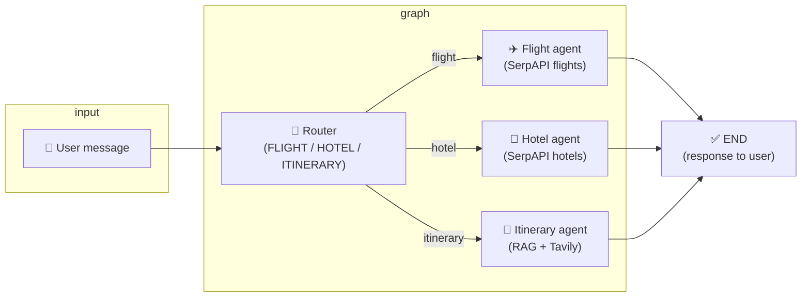

# Travel Planner

A **multi-agent travel assistant** built with LangGraph. It routes your questions to specialist agents (flights, hotels, or itineraries), uses RAG over travel blogs and web search, and supports multi-turn chat.

## What it does

- **Router** – Classifies your message and sends it to the right agent (flight, hotel, or itinerary).
- **Flight agent** – Extracts trip details from natural language and searches flights (SerpAPI Google Flights).
- **Hotel agent** – Searches hotels by location and dates (SerpAPI Google Hotels).
- **Itinerary agent** – Plans trips using RAG over indexed travel blogs (e.g. Japan) and live web search (Tavily).
- **Multi-turn chat** – Keeps conversation history in memory so you can ask follow-ups.

## Architecture: router → agent flow

Each user message is classified by the router, then sent to exactly one agent. All agents write to the same conversation state and the result is returned to the user.



| Step | Node | Description |
|------|------|-------------|
| 1 | **Router** | LLM classifies intent → `flight_agent`, `hotel_agent`, or `itinerary_agent`. |
| 2 | **Conditional edge** | Graph routes to the chosen agent. |
| 3 | **Agent** | One of: Flight (extract params + search), Hotel (tool-calling + search), Itinerary (RAG + web search). |
| 4 | **END** | Agent output is added to conversation state and returned. |

## Project structure

```
Travel_Planner/
├── src/
│   ├── main.py              # Entry point: build graph, run chat
│   ├── agents/              # Graph node logic
│   │   ├── flight.py        # Flight search + parameter extraction
│   │   ├── hotel.py         # Hotel search + tool-calling agent
│   │   └── itinerary.py     # Itinerary agent with RAG + Tavily
│   ├── prompts/
│   │   ├── itinerary.py     # Itinerary system prompt
│   │   ├── flight.py        # Flight + extraction prompts
│   │   └── hotel.py         # Hotel system prompt
│   └── vectorstores/
│       └── pinecone_store.py # Custom Pinecone store (Python 3.14–compatible)
├── tests/
│   └── test_main.py
├── requirements.txt
├── pyproject.toml
├── .env.example
├── .gitignore
└── README.md
```

## Installation

**Python 3.10+** (tested on 3.14). This project uses a custom Pinecone vector store when `langchain-pinecone` is not available for your Python version.

1. Clone the repo and create a virtual environment:

```bash
python -m venv venv
```

2. Activate it:

```bash
# macOS/Linux
source venv/bin/activate

# Windows
venv\Scripts\activate
```

3. Install dependencies:

```bash
pip install -r requirements.txt
```

## Environment variables

1. Copy the example env file:

```bash
cp .env.example .env
```

2. Edit `.env` and set your API keys:

| Variable | Required | Description |
|----------|----------|-------------|
| `OPENAI_API_KEY` | Yes | OpenAI API key (LLM + embeddings). |
| `PINECONE_API_KEY` | Yes | Pinecone key for the RAG vector index. |
| `TAVILY_API_KEY` | Yes | Tavily key for web search in the itinerary agent. |
| `SERPAPI_API_KEY` | For flight/hotel | SerpAPI key for flight and hotel search. Omit to disable those tools. |
| `LANGCHAIN_TRACING_V2` | No | Set to `true` for LangSmith tracing. |
| `LANGCHAIN_API_KEY` | No | LangSmith API key if tracing is enabled. |
| `LANGCHAIN_PROJECT` | No | LangSmith project name (e.g. `travel-planner`). |

## Usage

Run the application (starts multi-turn chat after the graph is built):

```bash
python -m src.main
```

Or:

```bash
python src/main.py
```

In the chat:

- Ask for **flights** (e.g. “Book a flight from NYC to Paris, Oct 28–31, 2026”).
- Ask for **hotels** (e.g. “Find hotels in Tokyo, check-in Dec 1, check-out Dec 5”).
- Ask for **itineraries** (e.g. “Plan a one-week trip to Japan” or “Week in San Francisco”).

Type **`quit`** or press Enter with no text to exit.

## Development

Run tests:

```bash
pytest
```

With coverage:

```bash
pytest --cov=src
```

Format and lint:

```bash
black src/ tests/
flake8 src/ tests/
```

## License

MIT
